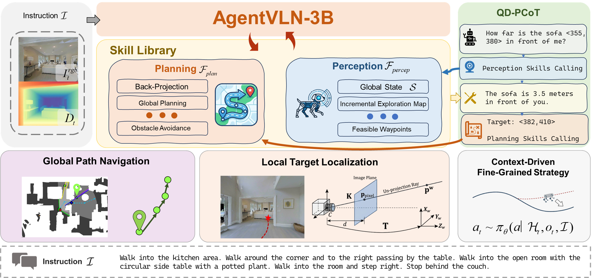
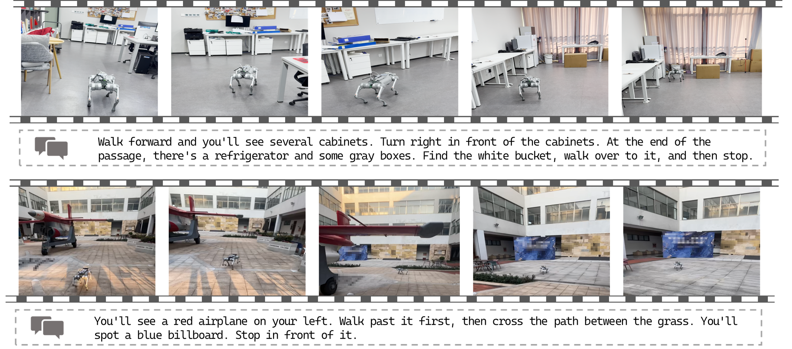
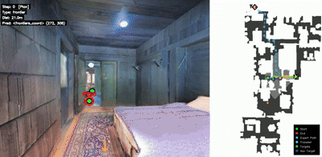
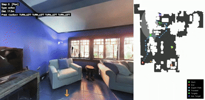
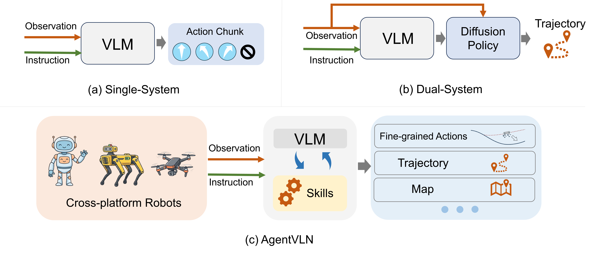
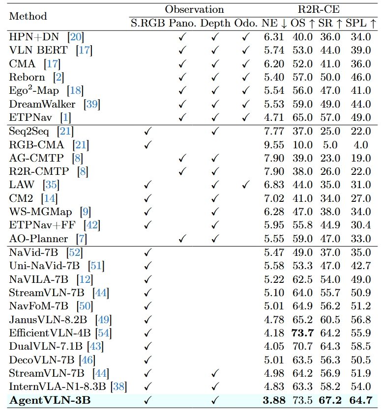
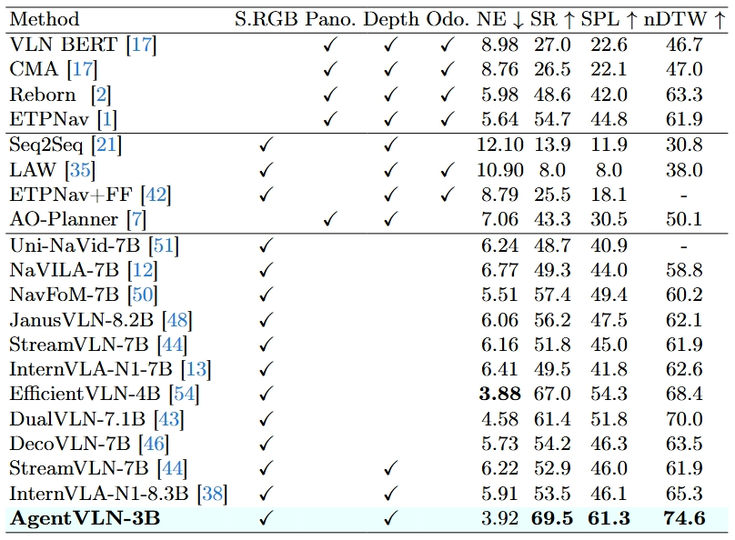

<h1 align="center">AgentVLN: Towards Agentic Vision-and-Language Navigation</h1>

<p align="center">
  <a href="https://allenxinn.github.io/AgentVLN/"></a>
  <a href="https://arxiv.org/abs/2603.17670"></a>
  <a href="https://huggingface.co/datasets/allenxinn/AgentVLN-Instruct"></a>
  <!-- <a href="https://github.com/Allenxinn/AgentVLN"></a> -->
</p>

<!--
<p align="center">
  <strong>Zihao Xin</strong><sup>1</sup>,
  <strong>Wentong Li</strong><sup>1,&dagger;</sup>,
  <strong>Yixuan Jiang</strong><sup>1</sup>,
  <strong>Ziyuan Huang</strong><sup>1</sup>,
  <strong>Bin Wang</strong><sup>2</sup>,
  <strong>Piji Li</strong><sup>1</sup>,
  <strong>Jianke Zhu</strong><sup>3</sup>,
  <strong>Jie Qin</strong><sup>1</sup>,
  <strong>Sheng-Jun Huang</strong><sup>1,*</sup>
</p>

<p align="center">
  <sup>1</sup>Nanjing University of Aeronautics and Astronautics
  <br>
  <sup>2</sup>Shandong University
  <br>
  <sup>3</sup>Zhejiang University
  <br>
  <sup>&dagger;</sup>Project Lead,
  <sup>*</sup>Corresponding Author
</p>
-->


## News

* **[2026.04.01]** We release the [AgentVLN-Instruct dataset](https://huggingface.co/datasets/allenxinn/AgentVLN-Instruct) on HuggingFace.

##


<p align="center">
  
</p>

AgentVLN is an efficient embodied navigation framework for long-horizon vision-and-language navigation in unseen environments. It formulates VLN as a POSMDP and follows a **VLM-as-Brain** paradigm that decouples high-level semantic reasoning from low-level perception and planning through a plug-and-play skill library.


## Real-world Deployment

<p align="center">
  
</p>

Real-world experiments show that AgentVLN can execute instruction-following navigation in both indoor and outdoor scenes, while maintaining robust planning and efficient deployment. We will release real-world video demos soon.


### Simulation demos
<p align="center">
     &nbsp;&nbsp;&nbsp;&nbsp; &nbsp;&nbsp;&nbsp;&nbsp;  &nbsp;&nbsp;&nbsp;&nbsp;    
</p>

<p align="center">
     &nbsp;&nbsp;&nbsp;&nbsp; &nbsp;&nbsp;&nbsp;&nbsp;  &nbsp;&nbsp;&nbsp;&nbsp;    
</p>

Please see our <a href="https://allenxinn.github.io/AgentVLN/"> project page </a> for HD demo.
<!--
Simulation demos: [Demo 1](assets/videos/vis_1.mp4) | [Demo 2](assets/videos/vis_2.mp4) | [Demo 3](assets/videos/vis_3.mp4) | [Demo 4](assets/videos/vis_4.mp4)
-->

## Highlights

- **VLM-as-Brain Navigation**: AgentVLN decomposes long-horizon navigation into high-level reasoning and modular skill execution under a unified agentic framework.
- **Cross-space Representation Mapping**: 3D topological waypoints are projected into the image plane as pixel-aligned visual prompts, bridging the gap between 3D planning and 2D VLM perception.
- **Context-aware Self-correction**: fine-grained active exploration helps the agent recover from occlusions, blind spots, and trajectory drift during long-horizon navigation.
- **QD-PCoT for Spatial Ambiguity**: the Query-Driven Perceptual Chain-of-Thought mechanism enables the agent to actively query missing geometric cues for more precise target grounding.
- **Lightweight Edge Deployment**: AgentVLN achieves a strong accuracy-efficiency trade-off and supports real-time local inference on embedded edge platforms.

## Efficiency

<p align="center">
  
</p>

Compared with prior VLN systems that rely on larger models or remote cloud execution, AgentVLN is designed for efficient local deployment. The framework delivers a better accuracy-efficiency balance on long-horizon VLN benchmarks while remaining lightweight enough for real-time on-device inference.

## Experimental Results

<p align="center">
  
</p>

<p align="center">
  
</p>

AgentVLN consistently outperforms prior state-of-the-art methods on the Val-Unseen splits of **R2R-CE** and **RxR-CE**, demonstrating strong generalization in complex unseen environments.

## TODO
- [x] Release the project page and paper PDF
- [x] Release AgentVLN-Instruct
- [ ] Open-source training and inference code
- [ ] Release pretrained model checkpoints
- [ ] Add installation and environment setup instructions

## Citation
```latex
@misc{xin2026agentvln,
      title={AgentVLN: Towards Agentic Vision-and-Language Navigation},
      author={Zihao Xin and Wentong Li and Yixuan Jiang and Ziyuan Huang and Bin Wang and Piji Li and Jianke Zhu and Jie Qin and Sheng-Jun Huang},
      year={2026},
      eprint={2603.17670},
      archivePrefix={arXiv},
      primaryClass={cs.RO},
      url={https://arxiv.org/abs/2603.17670}, 
}
```
